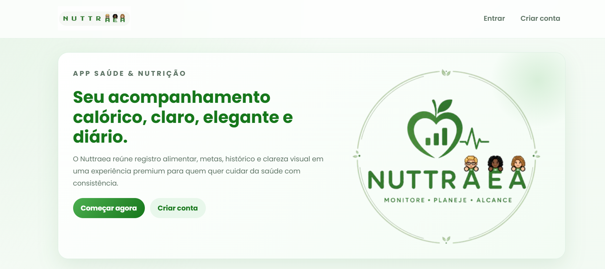

# Nuttraea 

Sistema web desenvolvido em **Python** utilizando o framework **Django**, destinado ao monitoramento do consumo calórico diário de estudantes, promovendo maior consciência alimentar por meio do registro de refeições, cálculo automático de calorias e definição de metas nutricionais personalizadas.

# 

# Demonstração

*A imagem abaixo apresenta uma visão geral da interface do sistema.*

<p align="center">
    
</p>


---

# Sobre o projeto

O **Nuttraea** é uma plataforma web desenvolvida para auxiliar estudantes no acompanhamento da alimentação diária de forma simples, intuitiva e acessível.

O sistema permite registrar refeições consumidas ao longo do dia, calcular automaticamente o total de calorias ingeridas, comparar esse valor com uma meta calórica personalizada e fornecer feedback nutricional ao usuário.

Além disso, o projeto integra uma base de dados nutricional externa para automatizar a obtenção das informações dos alimentos, reduzindo cálculos manuais e tornando o processo de monitoramento mais eficiente.

O desenvolvimento do sistema busca integrar tecnologia, educação e saúde, incentivando hábitos alimentares mais conscientes e contribuindo para a melhoria da qualidade de vida e do desempenho acadêmico dos estudantes.

---

# Objetivos

## Objetivo geral

Desenvolver um sistema inteligente, acessível e intuitivo para auxiliar estudantes no monitoramento da ingestão calórica diária, promovendo maior consciência alimentar.

## Objetivos específicos

- Registrar refeições diárias dos usuários;
- Calcular automaticamente calorias e macronutrientes;
- Integrar o sistema a uma base nutricional externa;
- Definir metas calóricas personalizadas;
- Comparar o consumo diário com a meta estabelecida;
- Fornecer feedback nutricional automático;
- Armazenar o histórico alimentar do usuário.

---

# Funcionalidades

- Cadastro e autenticação de usuários;
- Perfil nutricional personalizado;
- Definição automática da meta calórica;
- Registro de refeições;
- Cálculo automático de calorias;
- Consulta automática à base nutricional;
- Histórico alimentar;
- Feedback nutricional diário;
- Interface responsiva.

---

# Tecnologias utilizadas

- Python
- Django
- SQLite
- HTML5
- CSS3
- Bootstrap
- JavaScript

---

# Documentação oficial

Durante o desenvolvimento do projeto foi utilizada como principal referência a documentação oficial do framework Django, conforme as boas práticas recomendadas para implementação das funcionalidades.

**Documentação utilizada**

https://docs.djangoproject.com/en/6.0/

---

# Arquitetura do projeto

O projeto foi organizado em aplicações Django independentes, favorecendo a modularização e a manutenção do código.

```text
pcc/
├── alimentacao/
├── perfil/
├── refeicoes/
├── core/
├── manage.py
├── db.sqlite3
├── requirements.txt
└── README.md
```

---

# Acesse o Nuttraea via web
https://nuttraea.onrender.com/

---

# Como executar o projeto

## Clonar o repositório

```bash
git clone https://github.com/EllisCarvalho3/pcc.git
```

Entrar na pasta

```bash
cd pcc
```

---

## Criar ambiente virtual

### Windows

```bash
python -m venv venv

venv\Scripts\activate
```

### Linux

```bash
python3 -m venv venv

source venv/bin/activate
```

---

## Instalar dependências

```bash
pip install -r requirements.txt
```

---

## Executar migrações

```bash

python manage.py migrate
```

---

## Executar o servidor

```bash
python manage.py runserver
```

Depois acesse

```text
http://127.0.0.1:8000/
```

---

# Fundamentação

O desenvolvimento do sistema fundamenta-se na promoção da alimentação saudável entre estudantes, considerando que a rotina escolar frequentemente dificulta o planejamento alimentar e favorece o consumo de alimentos ultraprocessados.

Ao permitir o monitoramento diário da alimentação, o Nuttraea busca incentivar escolhas alimentares mais conscientes e contribuir para o bem-estar e o desempenho acadêmico dos usuários.

---

# Equipe

**Orientador**

- Prof. Reinaldo Monteiro Cotrim

**Equipe do projeto**

- Ellis Carvalho Xavier
- Álvaro Guedes
- Anna Lívia Magalhães

---

# Desenvolvimento do software

Embora o projeto tenha sido desenvolvido em equipe no contexto acadêmico, todo o desenvolvimento do software, incluindo análise, modelagem, implementação do sistema, interface e integração entre os módulos, foi realizado por:

**Ellis Carvalho Xavier**

---

# Licença

Projeto desenvolvido como requisito parcial para a aprovação no Curso Técnico em Informática para Internet.
